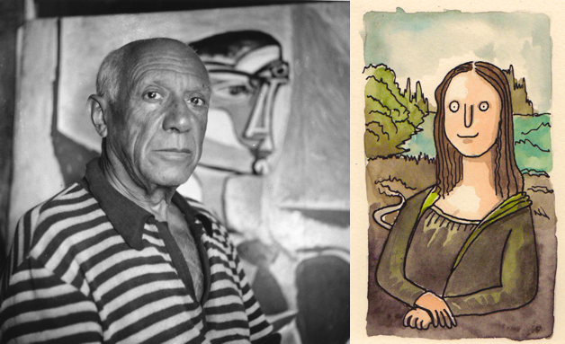

# dall-e-baby



OpenAI's [dall-e](https://openai.com/blog/dall-e/) is a kick ass model that takes in a natural language prompt and generates an images based on that. Now I cannot recreate the complete Dall-E so I make the baby version of it trained in CIFAR10-100 dataset. If Dall-E is picasso this is well... shit.

## Stream

I am streaming the progress of this side-project on [Youtube](https://www.youtube.com/watch?v=B1UY8G44N3U), do check it out. 

## Datasets

Originally I was a fool who scraped images for the dataset, that is a very stupid process. Instead I should have first gone for [academictorrents.com](https://academictorrents.com/). This is a list of datasets I will be using in v2 of this model (these are just for training the AutoEncoder model):
|name|size|image count|link|used for VAE|captions given|captions generated|
|-|-|-|-|-|-|-|
|Downscale OpenImagesv4|16GB|1.9M|[torrent](https://academictorrents.com/details/9208d33aceb2ca3eb2beb70a192600c9c41efba1)|✅| |✅|
|Stanford STL-10|2.64GB|113K|[torrent](https://academictorrents.com/details/a799a2845ac29a66c07cf74e2a2838b6c5698a6a)|✅| |✅|
|CVPR Indoor Scene Recognition|2.59GB|15620|[torrent](https://academictorrents.com/details/59aa0ad684e5d849f68bad9a6d43a9000a927164)|✅| |✅|
|The Visual Genome Dataset v1.0 + v1.2 Images|15.20GB|108K|[torrent](https://academictorrents.com/details/1bfe6871046860a2ff8c0cc1414318beb35dc916)|✅|✅|
|Food-101|5.69GB|101K|[torrent](https://academictorrents.com/details/470791483f8441764d3b01dbc4d22b3aa58ef46f)|✅| |✅|
|The Street View House Numbers (SVHN) Dataset|2.64GB|600K|[torrent](https://academictorrents.com/details/6f4caf3c24803d114c3cae3ab9cb946cd23c7213)|✅| |✅|
|Downsampled ImageNet 64x64|12.59GB|1.28M|[torrent](https://academictorrents.com/details/96816a530ee002254d29bf7a61c0c158d3dedc3b)|✅| |
|COCO 2017|52.44GB|287K|[torrent](https://academictorrents.com/details/74dec1dd21ae4994dfd9069f9cb0443eb960c962) [website](https://cocodataset.org/#download)| |✅| |
|Flickr 30k Captions (bad data, downloads duplicates)|8GB|31K|[kaggle](https://www.kaggle.com/hsankesara/flickr-image-dataset)| |✅| | 

In order to download the files please refer to the instructions in [download.txt](download.txt). Note that though this looks like a shell file it still needs to be run in parallel to take full advantage.

### Caption Datasets

Of the datasets above `Visual Genome, COCO, Flickr30K` has captions assosicated with the image. Rest of them have classes asssociated with each one of the images. In order to generate captions for the datasets run the script `python3 generate_captions.py` you need to have the above mentioned datasets on your system to do that. This will log all the details and create a json that looks like this (ignore double `open_images` :P):
```json
{
  "open_images_open_images_0123e1f263cf714f": {
      "path": "../downsampled-open-images-v4/256px/validation/0123e1f263cf714f.jpg",
      "caption": "low res photo of human hand"
  },
  "indoor_15613": {
    "path": "../indoorCVPR/winecellar/wine_storage_42_07_altavista.jpg",
    "caption": "picture inside of winecellar"
  }
}
```

## Training

### Variational AutoEncoder

First step is to clean the data using an extra script provided `python3 clean_data.py`. **Note** that you need to update the `folders` as per your requirements. Train a discrete VAE easily by running:
```
python3 discrete_vae.py
```

It turns out training a VAE is not an easy task I trained using SGD but the training was taking too long and kept collapsing. Adam with gradient clipping works best. After training 100 models ([wandb](https://wandb.ai/yashbonde/vq-vae)) this configuration has the best size/performance: 
```
in_channels:    3
embedding_dim:  300
num_embeddings: 3000
hidden_dims:    [200, 300, 400]
add_residual:   False
```

And the dataset looks like this, however the model trains only after a 2462400 samples (~66.44%):
```
:: Dataset: <BabyDallEDataset (train) openimages256:1910396|food-101:101000|svhn:248823|indoor:15614|imagenet_train64x64:1331148|stl10:13000|genome1:64346|genome2:43733|total:3728060|train:3705691>
```

Once the model is trained you can actaully visualise the embeddings learned (`codebook`) to obtain the textures (cool right!):


This model took >12 hours of training.

### Transformer GPT

In order to train the transformer model run the script:
```
python3 train_transformer.py
```

# Credits

This work would not have been possible because of millions of people who helped create the dataset.

## License

MIT License.
