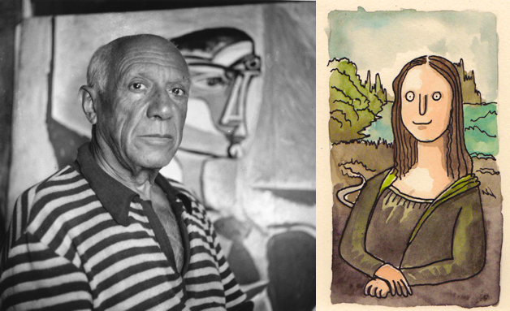

# dall-e-baby



OpenAI's [dall-e](https://openai.com/blog/dall-e/) is a kick ass model that takes in a natural language prompt and generates an images based on that. Now I cannot recreate the complete Dall-E so I make the baby version of it trained in CIFAR10-100 dataset. If Dall-E is picasso this is well... shit.

## Training

First step is to train a discrete VAE which can be done by:
```
python3 discrete_vae.py
...
[TRAIN - 12] GS: 3999, Loss: 0.25907:  94%|█████████████████████████████████████████████████████████████████████████▍    | 291/309 [01:01<00:03,  4.82it/s]Saving Model at models/vae_4000.pt
[TRAIN - 12] GS: 4016, Loss: 0.24636: 100%|█████████████████████████████████████████████████████████████████████████████▋| 308/309 [01:05<00:00,  4.72it/s]
...
```

It turns out training a VAE is not an easy task I trained using SGD but the training was taking too long and kept collapsing. Adam with gradient clipping works best.
