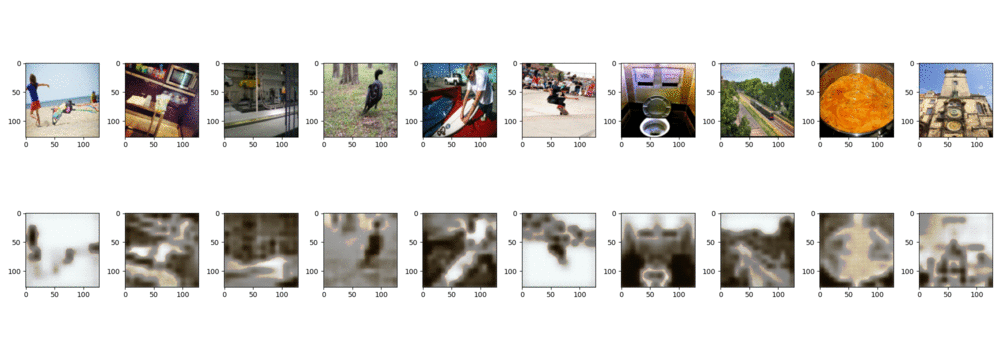

# dall-e-baby


OpenAI's [dall-e](https://openai.com/blog/dall-e/) is a kick ass model that takes in a natural language prompt and generates an images based on that. Now I cannot recreate the complete Dall-E so I make the baby version of it trained in CIFAR10-100 dataset. If Dall-E is picasso this is well... shit.

## Stream

I am streaming the progress of this side-project on [Youtube](https://www.youtube.com/watch?v=B1UY8G44N3U&t=3019s), do check it out. 

## Training

First step is to train a discrete VAE which can be done by:
```
python3 discrete_vae.py
```

It turns out training a VAE is not an easy task I trained using SGD but the training was taking too long and kept collapsing. Adam with gradient clipping works best. After training over a 90 models I found out that the best model was with `res:64, batch_size:128, num_embedding:1024, mid_res:16`. The models with larger mid size ie. where the low dimensional resolution is <4x the original resolution. Below is a sample from above configuration:


Where as what happens with config `res:128, batch_size:128, num_embedding:1024, mid_res:16`



## Datasets

Originally I was a fool who scraped images for the dataset, that is a very stupid process. Instead I should have first gone for [academictorrents.com](https://academictorrents.com/). This is a list of datasets I will be using in v2 of this model (these are just for training the AutoEncoder model):
|name|size|image_count|link|
|-|-|-|-|
|Downscale OpenImagesv4|16GB|1.9M|[torrent](https://academictorrents.com/details/9208d33aceb2ca3eb2beb70a192600c9c41efba1)|
|Stanford STL-10|2.64GB|113K|[torrent](https://academictorrents.com/details/a799a2845ac29a66c07cf74e2a2838b6c5698a6a)|
|The Visual Genome Dataset v1.0 + v1.2 Images|15.20GB|108K|[torrent](https://academictorrents.com/details/1bfe6871046860a2ff8c0cc1414318beb35dc916)|
|COCO 2017|52.44GB|287K|[torrent](https://academictorrents.com/details/74dec1dd21ae4994dfd9069f9cb0443eb960c962) [website](https://cocodataset.org/#download)|
|Yelp Restaurant Photo Classification Data (Has Duplicates)|14.14GB|NA|[torrent](https://academictorrents.com/details/19c3aa2166d7bfceaf3d76c0d36f812e0f1b87bc)|
|CVPR Indoor Scene Recognition|2.59GB|15620|[torrent](https://academictorrents.com/details/59aa0ad684e5d849f68bad9a6d43a9000a927164)|
|Flickr 30k Captions (bad data, downloads duplicates)|8GB|31K|[kaggle](https://www.kaggle.com/hsankesara/flickr-image-dataset)|

Of these datasets `Visual Genome, COCO, Flickr30K` has captions assosicated with the image. Rest of them have classes asssociated with each one of the images. We can then create create extra captions for each of the images using pretrained models like GPT-2.
